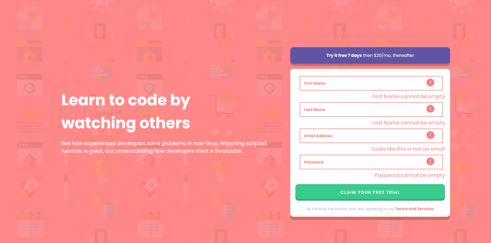

# Frontend Mentor - Intro component with sign up form solution

This is a solution to the [Intro component with sign up form challenge on Frontend Mentor](https://www.frontendmentor.io/challenges/intro-component-with-signup-form-5cf91bd49edda32581d28fd1). Frontend Mentor challenges help you improve your coding skills by building realistic projects.

- I also livestream do this project on facebook: https://www.facebook.com/joseph.webdev/videos/2972193099679368
- But i speak Vietnamese, so most of my friend can hear it

## Table of contents

- [Overview](#overview)
  - [The challenge](#the-challenge)
  - [Screenshot](#screenshot)
  - [Links](#links)
- [My process](#my-process)
  - [Built with](#built-with)
  - [What I learned](#what-i-learned)
- [Author](#author)

## Overview

### The challenge

Users should be able to:

- View the optimal layout for the site depending on their device's screen size
- See hover states for all interactive elements on the page
- Receive an error message when the `form` is submitted if:
  - Any `input` field is empty. The message for this error should say _"[Field Name] cannot be empty"_
  - The email address is not formatted correctly (i.e. a correct email address should have this structure: `name@host.tld`). The message for this error should say _"Looks like this is not an email"_

### Screenshot

#### Mobile Design

#### Desktop Design

### Links

- Solution URL: [FrontEnd Mentor](https://www.frontendmentor.io/solutions/responsive-sign-up-form-using-sass-and-javascript-GdKLdTOdz)
- Live Site URL: [Link](https://nifty-morse-1e3d58.netlify.app/)

## My process

### Built with

- Semantic HTML5 markup
- Sass
- Flexbox
- JavaScript
- Mobile-first workflow

### What I learned

- I am practicing JS, so this help me a lot

## Author

- Website - [Tin.Pham](https://github.com/tin-pham)
- Frontend Mentor - [@phambaohuy12345](https://www.frontendmentor.io/profile/phambaohuy12345)
- Facebook - [Tin Pham](https://www.facebook.com/joseph.webdev)
